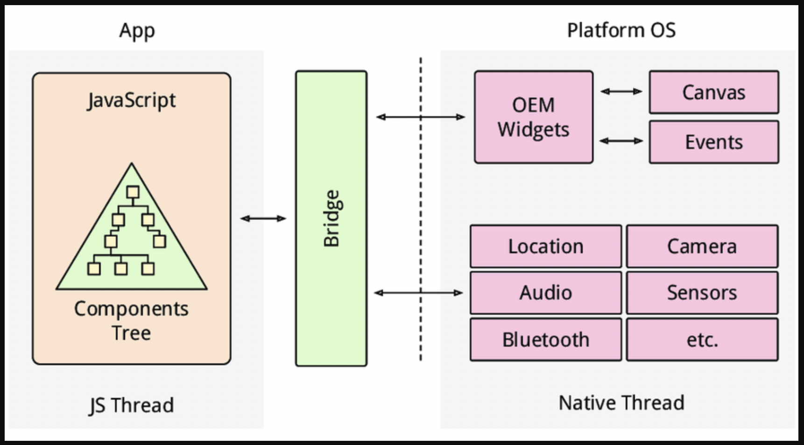

# React Native Bridging

### React Native Concepts


[Native Modules Intro · React Native](https://reactnative.dev/docs/0.68/native-modules-intro)

### React Native Bridging Diagram



### Android Bridging

[Android Native Modules · React Native](https://reactnative.dev/docs/0.68/native-modules-android)

1. Create module
    
    ```kotlin
    package com.xxx
    
    import com.facebook.react.bridge.NativeModule
    import com.facebook.react.bridge.ReactApplicationContext
    import com.facebook.react.bridge.ReactContext
    import com.facebook.react.bridge.ReactContextBaseJavaModule
    import com.facebook.react.bridge.ReactMethod
    import android.widget.Toast
    
    class CalendarModule(reactContext: ReactApplicationContext) : ReactContextBaseJavaModule(reactContext) {
        // add to CalendarModule.kt
        override fun getName() = "CalendarModule"
    
        @ReactMethod
        fun createCalendarEvent(message: String){
            Toast.makeText(getReactApplicationContext(), message,  Toast.LENGTH_SHORT).show()
        }
    }
    ```
    
2. Register module as react package
    
    ```kotlin
    package com.xxx
    
    import android.view.View
    import com.facebook.react.ReactPackage
    import com.facebook.react.bridge.NativeModule
    import com.facebook.react.bridge.ReactApplicationContext
    import com.facebook.react.uimanager.ReactShadowNode
    import com.facebook.react.uimanager.ViewManager
    
    class MyAppPackage : ReactPackage {
    
        override fun createViewManagers(
                reactContext: ReactApplicationContext
        ): MutableList<ViewManager<View, ReactShadowNode<*>>> = mutableListOf()
    
        override fun createNativeModules(
                reactContext: ReactApplicationContext
        ): MutableList<NativeModule> = listOf(CalendarModule(reactContext)).toMutableList()
    }
    ```
    
3. Add module from react package to the main application
    
    ```java
    package com.xxx;
    
    import ...
    
    public class MainApplication extends Application implements ReactApplication {
    
      private final ReactNativeHost mReactNativeHost =
          new ReactNativeHost(this) {
            @Override
            public boolean getUseDeveloperSupport() {
              return BuildConfig.DEBUG;
            }
    
            @Override
            protected List<ReactPackage> getPackages() {
              @SuppressWarnings("UnnecessaryLocalVariable")
              List<ReactPackage> packages = new PackageList(this).getPackages();
              // Packages that cannot be autolinked yet can be added manually here, for example:
              packages.add(new MyAppPackage());
              return packages;
            }
    
            @Override
            protected String getJSMainModuleName() {
              return "index";
            }
          };
    ...
    ```
    
4. Important! Add ktlin support to our project
    1. android/build-gradle
    
    ```jsx
    ...
    buildscript {
        ext {
            ...
            kotlin_version = '1.6.0'
            ...
        }
        repositories {...}
        dependencies {
            ....
            classpath("org.jetbrains.kotlin:kotlin-gradle-plugin:$kotlin_version")
    				...
        }
    }
    ...
    ```
    
    b. android/app/build-gradle
    
    ```jsx
    apply plugin: "com.android.application"
    apply plugin: "kotlin-android"
    ....
    ```
    
5. Create exporter
    
    ```jsx
    import { NativeModules } from 'react-native';
    const { CalendarModule } = NativeModules;
    
    export default CalendarModule;
    ```
    
6. Import and use components
    
    ```jsx
    const onPress = () => {
        CalendarModule.createCalendarEvent('Test 😃');
      };
    ```
    
